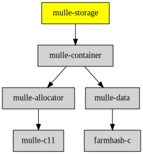

# mulle-storage

#### 🛅 Memory management for tree nodes

Why not just use `malloc` ? **mulle-storage** can be useful as a storage for 
nodes of a tree. It's likely faster and it may produce less fragmentation and 
it may improve locality of reference. Freed nodes will be reused. All the tree
nodes can be "blown" away at once, without having to free each node
individually.


Why is not a `mulle_structarray` ? A struct array would have holes, when nodes
are freed randomly. Also freed nodes on their own would need to be managed
externally. mulle-storage does this, but uses a struct queue instead, so it
does not have to deal with holes.


| Release Version                                       | Release Notes
|-------------------------------------------------------|--------------
|  [](//github.com/mulle-c/mulle-storage/actions) | [RELEASENOTES](RELEASENOTES.md) |


### You are here




## Add

**This project is a component of the [mulle-core](//github.com/mulle-core/mulle-core) library. As such you usually will *not* add or install it
individually, unless you specifically do not want to link against
`mulle-core`.**


### Add as an individual component

Use [mulle-sde](//github.com/mulle-sde) to add mulle-storage to your project:

``` sh
mulle-sde add github:mulle-c/mulle-storage
```

To only add the sources of mulle-storage with dependency
sources use [clib](https://github.com/clibs/clib):


``` sh
clib install --out src/mulle-c mulle-c/mulle-storage
```

Add `-isystem src/mulle-c` to your `CFLAGS` and compile all the sources that were downloaded with your project.


## Install

Use [mulle-sde](//github.com/mulle-sde) to build and install mulle-storage and all dependencies:

``` sh
mulle-sde install --prefix /usr/local \
   https://github.com/mulle-c/mulle-storage/archive/latest.tar.gz
```

### Legacy Installation

Install the requirements:

| Requirements                                 | Description
|----------------------------------------------|-----------------------
| [mulle-container](https://github.com/mulle-c/mulle-container)             | 🛄 Arrays, hashtables and a queue

Download the latest [tar](https://github.com/mulle-c/mulle-storage/archive/refs/tags/latest.tar.gz) or [zip](https://github.com/mulle-c/mulle-storage/archive/refs/tags/latest.zip) archive and unpack it.

Install **mulle-storage** into `/usr/local` with [cmake](https://cmake.org):

``` sh
cmake -B build \
      -DCMAKE_INSTALL_PREFIX=/usr/local \
      -DCMAKE_PREFIX_PATH=/usr/local \
      -DCMAKE_BUILD_TYPE=Release &&
cmake --build build --config Release &&
cmake --install build --config Release
```


## Author

[Nat!](https://mulle-kybernetik.com/weblog) for Mulle kybernetiK  


