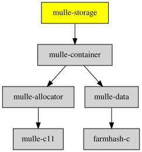

# mulle-storage

#### 🛅 Memory management for tree nodes

Why not just use `malloc` ? **mulle-storage** can be useful as a storage for 
nodes of a tree. It's likely faster and it may produce less fragmentation and 
it may improve locality of reference. Freed nodes will be reused. All the tree
nodes can be "blown" away at once, without having to free each node
individually.

Why not use a `mulle_structarray` ?  A struct array can realloc and so pointers
inside the struct array are not stable.


## Memory Model

Freed nodes are never returned to the system allocator. They are kept in an
internal free-list and reused on subsequent allocations. All memory is released
at once when `_mulle_storage_done` (or `_mulle_indexedstorage_done`) is called.
This means the high-water mark is permanent for the lifetime of the storage.

mulle-storage is **not thread-safe**. If you need to access a storage from
multiple threads, you must provide external synchronization.


| Release Version                                       | Release Notes  | AI Documentation
|-------------------------------------------------------|----------------|---------------
|  [](//github.com/mulle-c/mulle-storage/actions) | [RELEASENOTES](RELEASENOTES.md) | [DeepWiki for mulle-storage](https://deepwiki.com/mulle-c/mulle-storage)


## Documentation & Guides

* [API Summary](asset/dox/api/toc)


### You are here




## Add

mulle-storage is a component of the [mulle-core](//github.com/mulle-core/mulle-core) library. So in your code include the mulle-core umbrella header:

``` c
#include <mulle-core/mulle-core.h>
```

### Add mulle-core to a cmake and git project

``` bash
git submodule add https://github.com/mulle-core/mulle-core.git mulle-core
```

Add this to your `CMakeLists.txt`:

``` cmake
add_subdirectory( mulle-core)
target_link_libraries( ${PROJECT_NAME} PRIVATE mulle-core)
```


### Add mulle-core to a mulle-sde project

``` sh
mulle-sde add github:mulle-core/mulle-core
```

### Embed mulle-storage with clib

``` sh
clib install --out src mulle-c/mulle-storage
```

Append `src` to your include path (e.g. add `-isystem src`  to your `CFLAGS`)
and compile all the sources that were downloaded.


## Author

[Nat!](https://mulle-kybernetik.com/weblog) for Mulle kybernetiK  


